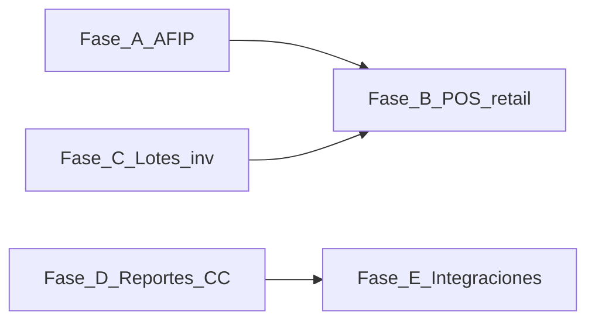

# Plan: Cobertura del gap competitivo vs Artics

> **Nota (2026-07):** Este plan es histórico (jun 2026). Muchos ítems marcados como gap ya están implementados (AFIP, NC/ND, remitos, lotes FEFO, cuenta corriente, POS medios de pago). Usar [docs/ROADMAP.md](../ROADMAP.md) como fuente de verdad del estado actual.

## Contexto

Andiko es un ERP modular (Next.js, PostgreSQL, Sequelize) con POS offline en Electron + SQLite y sincronización al cloud. Este documento traduce el gap frente al discurso comercial de **Artics** (POS + ERP para comercios argentinos) en un plan por fases accionable, enlazando trabajo ya espiralado en el repo.

**Referencia externa (marketing, alcance declarativo):** [Artics — Sistema POS y ERP completo](https://www.artics.com.ar/sistema-pos-y-erp-completo-para-comercios-argentinos/#content)

---

## Resumen ejecutivo

- **Base sólida:** multi-organización y sucursales, contactos, catálogo con variantes y listas de precios, flujo ventas (presupuesto → pedido → factura → cobro), inventario con depósitos y movimientos, compras (OC → recepción → factura proveedor → pagos), panel ejecutivo, permisos en base de datos, POS offline con sync y sesiones de caja.
- **Brecha principal vs “retail ARG completo” prometido en landings genéricas:** facturación **electrónica AFIP con CAE**, ampliación del **POS** (medios de pago, pagos mixtos, alineación fiscal), **lotes y trazabilidad** (no solo alertas MVP), **volumen y variedad de reportes**, **integraciones** (pagos / e-commerce), y capacidades **verticales o de hardware fiscal** que suelen quedar fuera de un MVP horizontal.
- **Dependencias:** la Fase A (AFIP) desbloquea requisitos legales de muchos clientes; lotes (Fase C) conviene antes o en paralelo con POS que deba respetar FIFO/FEFO.
- **Expectativas:** la landing de Artics lista decenas de rubros e integraciones; este plan prioriza **paridad fiscal y operativa** antes que verticalización (restaurant, farmacia, etc.).

---

## Tabla comparativa (Artics vs Andiko)

| Tema | Artics (promesa comercial) | Andiko hoy | Gap | Notas internas |
|------|---------------------------|------------|-----|----------------|
| AFIP / CAE / libros IVA | Factura electrónica, WSFE, CAE automático | Documentos de ventas internos; sin WSAA/WSFE | Alto | [docs/ROADMAP.md](../ROADMAP.md) Fase 6–7 |
| POS offline | Caja 100% offline, sync | Electron + SQLite, cola de sync | Medio | [docs/ROADMAP.md](../ROADMAP.md) sección POS |
| Medios de pago en POS | Efectivo, tarjetas, transferencias, QR MP, cuenta corriente, mixtos | `payments[]` dinámico por org/sucursal; tipos: cash, card, transfer, qr, current_account, check, other; código de operación; estructura lista para mixtos | Bajo–medio | `pos_payment_methods` + `pos_branch_payment_methods`; falta UI mixta y ejecución real de pagos electrónicos |
| Inventario multi-depósito | Stock por sucursal / depósito | Depósitos, movimientos, alertas | Bajo–medio | Transferencias entre depósitos vía movimientos |
| Lotes / vencimiento / IMEI | Lotes, vencimientos, serie | Alertas MVP en `stock_items`; sin modelo de lotes por cantidad | Alto | [docs/plans/gaps-competitivos-vencimientos-etiquetas-barcode.md](./gaps-competitivos-vencimientos-etiquetas-barcode.md) |
| Remitos | Remitos de entrega | No implementado | Medio | [docs/ROADMAP.md](../ROADMAP.md) Fase 4 pendientes |
| Notas de crédito | NC desde POS / ERP | Pendiente en roadmap ventas | Medio | [docs/ROADMAP.md](../ROADMAP.md) Fase 3 |
| Cuenta corriente clientes | CC y límites | UI `/ventas/cuenta-corriente` + API de estado de cuenta; roadmap aún marca listado agregado pendiente | Bajo–medio | Reconciliar checklist en ROADMAP con código |
| Cuenta corriente proveedores | AP / CC proveedor | Pendiente vista dedicada | Medio | [docs/ROADMAP.md](../ROADMAP.md) Fase 5 |
| Reportes “100+” | Amplio catálogo | Dashboard + listados; reportes analíticos pendientes | Alto | ROADMAP Fase 3–5 pendientes |
| Integraciones | Mercado Pago, ML, Tiendanube, etc. | Backlog explícito; onboarding lista integraciones como UI/config futura | Alto | [docs/ROADMAP.md](../ROADMAP.md) Backlog |
| Contabilidad | Implícita en propuesta integral | No implementada | Alto | ROADMAP Fase 7 |
| Hardware fiscal / térmica | Hasar, Epson, balanzas | Impresión documentos vía web / PDF; sin drivers fiscales | Alto | Backlog producto |
| Vertical restaurante | Mesas, comandas, cocina | No | Alto | Backlog |

---

## Plan por fases

Orden sugerido por dependencia de datos y valor comercial.

### Fase A — Facturación electrónica AFIP

**Objetivo:** cerrar el gap frente a “CAE automático” y cumplimiento fiscal básico de ventas.

**Entregables (alineados a [docs/ROADMAP.md](../ROADMAP.md) Fase 6):**

- Autenticación WSAA con certificado digital.
- Emisión vía WSFEv1 (Facturas A/B/C según corresponda).
- Notas de crédito y débito electrónicas.
- Persistencia de CAE, números de comprobante AFIP y datos de auditoría.
- Reimpresión / regeneración de PDF o ticket con datos de autorización.
- Modo contingencia: cola offline con sincronización posterior (coherente con POS).

**Dependencias:** modelo de documento de venta estable ([`src/modules/sales/`](../../src/modules/sales/)); política de numeración ya existente debe coexistir o migrarse a numeración fiscal.

**Referencias:** ROADMAP “Fase 6 — AFIP / Facturación Electrónica”.

**Criterios de done:**

- Emisión exitosa en ambiente de homologación AFIP con CAE almacenado en base.
- Flujo documentado de renovación de certificado y manejo de errores WSFE.

---

### Fase B — POS: paridad “caja Argentina”

**Objetivo:** acercar el POS al mix de medios y flujos que el mercado espera una vez exista base fiscal.

**Entregables:**

- Extender `PosSale` y handlers SQLite/Electron para medios adicionales (ej. QR, cuenta corriente, cheque) y **pagos combinados** sobre una misma venta.
- Integrar emisión o asociación de comprobante fiscal cuando Fase A esté disponible (ticket vs factura según reglas de negocio).
- Completar ítems pendientes del ROADMAP POS: reconciliación pull (`GET` sync de ventas ya aceptadas), sincronización automática en background donde aplique.
- Notas de crédito / devoluciones desde POS acotadas al modelo legal (depende de NC electrónica o interna).

**Dependencias:** Fase A para comprobantes con validez fiscal; opcionalmente Fase C si las devoluciones deben devolver stock por lote.

**Referencias:** [packages/shared/src/index.ts](../../packages/shared/src/index.ts); [`docs/plans/mvp-competitivo-facilvirtual.md`](./mvp-competitivo-facilvirtual.md) (contexto retail).

**Estado:** ✅ Parcialmente completo (commit `b580987`)

- ✅ `payments[]` dinámico reemplaza `payment_method` fijo — tipos configurables por org/sucursal
- ✅ Código de operación opcional para medios no-efectivo
- ✅ PIN requerido en apertura y cierre de turno
- ✅ Cancelación de venta con confirmación
- ✅ Sync robusto con errores visibles por venta/turno
- ⬜ UI de selección múltiple de medios en un mismo ticket (estructura lista, falta UX)
- ⬜ Ejecución real de pagos electrónicos (QR MP, MODO, terminal posnet)
- ⬜ Comprobante fiscal asociado (depende Fase A — AFIP)

**Criterios de done originales:**

- ✅ Venta de prueba con medio de pago dinámico y sync correcto al cloud
- ⬜ Venta con dos medios de pago en un solo ticket
- ⬜ Lista de `local_id` sincronizados recuperable desde API para auditoría de caja

---

### Fase C — Inventario: lotes y trazabilidad

**Objetivo:** soportar vencimientos reales, FIFO/FEFO y bases para rubros regulados (alimentos, farmacia) sin mentir con un solo `expires_on` por ítem.

**Entregables:**

- Implementar modelo de lotes y deducción en ventas según el diseño ya descrito en [docs/plans/gaps-competitivos-vencimientos-etiquetas-barcode.md](./gaps-competitivos-vencimientos-etiquetas-barcode.md).
- Completar ROADMAP: “Trazabilidad por lotes” y vínculo explícito en movimientos.

**Dependencias:** migraciones nuevas; actualización de [`src/modules/inventory/stock-movements.service.ts`](../../src/modules/inventory/stock-movements.service.ts) y APIs relacionadas.

**Extensión opcional posterior:** números de serie / IMEI por unidad o por movimiento (tabla dedicada).

**Criterios de done:**

- Compra con dos lotes distintos del mismo SKU muestra dos vencimientos; venta descuenta por política FEFO/FIFO acordada.
- Dashboard de vencimientos alimentado desde lotes, no desde columna única en `stock_items`.

---

### Fase D — Reportes y cuentas corrientes

**Objetivo:** reducir distancia frente a catálogos grandes de reportes y cerrar vistas financieras operativas.

**Entregables:**

- Reportes de ventas por período, cliente y producto (ROADMAP Fase 3 pendientes).
- Reportes de compras por período, proveedor y categoría (ROADMAP Fase 5).
- Vista cuenta corriente proveedor (`/compras/proveedores/[id]/cuenta-corriente`) descrita en ROADMAP.
- Notas de crédito internas si siguen pendientes respecto al roadmap.
- Revisión explícita del ítem ROADMAP “Listado de cuentas corrientes por cliente” frente a [`src/app/(erp)/ventas/cuenta-corriente/`](../../src/app/(erp)/ventas/cuenta-corriente/) para actualizar el checklist o completar funcionalidad faltante.

**Criterios de done:**

- Export CSV o vista imprimible para al menos dos reportes analíticos priorizados por el negocio.
- CC proveedor con saldo coincidente con suma de documentos en rango de prueba.

---

### Fase E — Integraciones comerciales

**Objetivo:** pagos y canales online sin trabajo manual repetitivo.

**Entregables (priorización por defecto — ajustar por ICP):**

1. **Mercado Pago** (QR / cobros / conciliación parcial con cobros en ventas).
2. **Canal e-commerce** (una integración: WooCommerce o Tienda Nube según demanda).
3. Marketplace (Mercado Libre) si el vertical lo exige.

**Referencias:** ROADMAP Backlog; pantalla de onboarding lista integraciones como configuración futura.

**Criterios de done:**

- Webhook o polling documentado; conciliación de al menos un cobro de prueba contra factura interna.

---

### Fase F — Backlog explícito (sin fecha)

Temas que aparecen en landings competitivas pero no están en el camino crítico del ERP horizontal:

- Gastronomía: mesas, comandas, cocina, delivery integrado.
- Impresoras fiscales y térmicas nativas (Hasar, Epson ESC/POS).
- Balanzas y productos pesables.
- Autenticación de dos factores para usuarios ERP.
- BI avanzado o “100+ reportes” como producto aparte.
- Multi-razón social en una sola instalación ([docs/ROADMAP.md](../ROADMAP.md) Backlog).

Sirven para gestión de expectativas frente a propuestas tipo Artics sin comprometer roadmap core.

---

## Mantenimiento de este documento

Al cerrar ítems en [docs/ROADMAP.md](../ROADMAP.md) o implementar fases, actualizar la tabla comparativa y los criterios de done para evitar drift entre marketing interno y código.

Si el alcance del competidor deja de ser relevante, archivar este archivo o sustituirlo por una nueva referencia competitiva.
