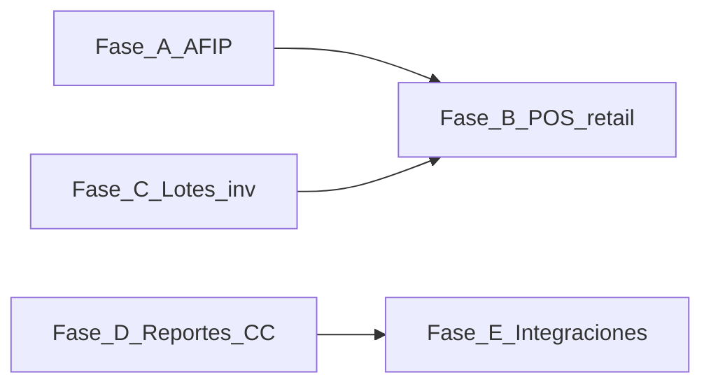

# Plan: Cobertura del gap competitivo vs Artics

> **Última revisión contra código:** 2026-07-09. Fuente de verdad operativa: [docs/ROADMAP.md](../ROADMAP.md). Este documento resume el gap competitivo vs Artics; la tabla comparativa se valida contra `src/modules/` y `apps/pos/`.

## Contexto

Andiko es un ERP modular (Next.js, PostgreSQL, Sequelize) con POS offline en Electron + SQLite y sincronización al cloud. Este documento traduce el gap frente al discurso comercial de **Artics** (POS + ERP para comercios argentinos) en un plan por fases accionable, enlazando trabajo ya espiralado en el repo.

**Referencia externa (marketing, alcance declarativo):** [Artics — Sistema POS y ERP completo](https://www.artics.com.ar/sistema-pos-y-erp-completo-para-comercios-argentinos/#content)

---

## Resumen ejecutivo

- **Base sólida (implementada):** multi-org/sucursales, contactos, catálogo, ventas (presupuesto → pedido → factura → cobro), NC/ND, devoluciones, CC clientes/proveedores, reportes analíticos, inventario con lotes FEFO/remitos/transferencias, compras completas, **AFIP WSFE con CAE**, POS offline con turnos/cierre/AFIP en ticket, WooCommerce nativo, billing SaaS.
- **Brecha principal vs “retail ARG completo” (jul 2026):** pagos mixtos en UI POS, cobro electrónico real (MP/QR), contabilidad auto-posting de ventas/compras, tesorería AR (retenciones, cheques, banco), hardware fiscal nativo, verticales (resto, farmacia pesada), catálogo masivo de reportes tipo “100+”.
- **Expectativas:** la landing de Artics lista decenas de rubros e integraciones; Andiko ya tiene paridad fiscal y operativa core, pero no verticalización ni suite contable/tesorería completa.

---

## Tabla comparativa (Artics vs Andiko)

*Validada contra código el 2026-07-09.*

| Tema | Artics (promesa comercial) | Andiko hoy (código) | Gap | Notas internas |
|------|---------------------------|----------------------|-----|----------------|
| AFIP / CAE / libros IVA | Factura electrónica, WSFE, CAE automático | ✅ WSAA/WSFE (`src/modules/afip/`), CAE en facturas/NC/ND, libros IVA, contingencia, POS authorize | Bajo | Validar en homologación/producción con cert real |
| POS offline | Caja 100% offline, sync | ✅ Electron + SQLite, sync bidireccional, turnos, cierre, AFIP en ticket | Bajo | Falta firma de código + auto-update |
| Medios de pago en POS | Efectivo, tarjetas, transferencias, QR MP, cuenta corriente, mixtos | ✅ Métodos dinámicos por org/sucursal; checkout **un medio por ticket** (`SaleScreen.tsx`); backend `payments[]` listo para mixtos | Medio | UI mixta + ejecución real MP/QR/posnet |
| Inventario multi-depósito | Stock por sucursal / depósito | ✅ Depósitos, movimientos, transferencias, reposición | Bajo | WMS lite / conteo físico pendiente |
| Lotes / vencimiento / IMEI | Lotes, vencimientos, serie | ✅ `stock_item_batches` + FEFO (`stock-batches.service.ts`); IMEI/serie no | Medio | Serie/IMEI en backlog |
| Remitos | Remitos de entrega | ✅ `delivery-notes.service.ts`, `/inventario/remitos` | Bajo | — |
| Notas de crédito | NC desde POS / ERP | ✅ NC/ND ERP + AFIP; devoluciones POS → `sales-returns.service.ts` | Bajo | — |
| Cuenta corriente clientes | CC y límites | ✅ `/ventas/cuenta-corriente`, aging, export CSV | Medio | Sin límite de crédito ni workflow cobranzas |
| Cuenta corriente proveedores | AP / CC proveedor | ✅ `/compras/cuenta-corriente`, aging CxP | Bajo | — |
| Reportes “100+” | Amplio catálogo | ✅ Reportes ventas/compras + panel; no catálogo masivo | Medio | PyG, export estudio, BI avanzado pendientes |
| Integraciones | Mercado Pago, ML, Tiendanube, etc. | ✅ WooCommerce nativo; MP/ML/Tiendanube en backlog | Medio | E-commerce cubierto; pagos online no |
| Contabilidad | Implícita en propuesta integral | ⚠️ Plan de cuentas + asientos manuales + auto en devoluciones; sin auto-post ventas/compras | Alto | ROADMAP Fase 7 ~56% |
| Hardware fiscal / térmica | Hasar, Epson, balanzas | ⚠️ Ticket 80 mm + PDF; PLU/balanza barcode en POS; sin drivers fiscales RS-232 | Alto | Fase 8 pendiente |
| Vertical restaurante | Mesas, comandas, cocina | ❌ No | Alto | Backlog |

---

## Plan por fases

Orden sugerido por dependencia de datos y valor comercial.

### Fase A — Facturación electrónica AFIP

**Estado:** ✅ **Completo en código** (ROADMAP Fase 6 al 100%).

Implementado en `src/modules/afip/` (WSAA, WSFE, CAE, NC/ND, libros IVA, contingencia) y `src/modules/pos/pos-fiscal.service.ts` (authorize desde POS). Pendiente operativo: validación con certificados reales en homologación/producción y cobertura E2E.

---

### Fase B — POS: paridad “caja Argentina”

**Objetivo:** acercar el POS al mix de medios y flujos que el mercado espera una vez exista base fiscal.

**Entregables:**

- Extender `PosSale` y handlers SQLite/Electron para medios adicionales (ej. QR, cuenta corriente, cheque) y **pagos combinados** sobre una misma venta.
- Integrar emisión o asociación de comprobante fiscal cuando Fase A esté disponible (ticket vs factura según reglas de negocio).
- Completar ítems pendientes del ROADMAP POS: reconciliación pull (`GET` sync de ventas ya aceptadas), sincronización automática en background donde aplique.
- Notas de crédito / devoluciones desde POS acotadas al modelo legal (depende de NC electrónica o interna).

**Dependencias:** Fase A para comprobantes con validez fiscal; opcionalmente Fase C si las devoluciones deben devolver stock por lote.

**Referencias:** [packages/shared/src/index.ts](../../packages/shared/src/index.ts); [`docs/plans/mvp-competitivo-facilvirtual.md`](./mvp-competitivo-facilvirtual.md) (contexto retail).

**Estado:** ✅ **Casi completo** — gap restante: pagos mixtos en UI + cobro electrónico real.

- ✅ `payments[]` dinámico — tipos configurables por org/sucursal
- ✅ Código de operación opcional para medios no-efectivo
- ✅ PIN en apertura/cierre de turno; cierre de caja; sync pull/push
- ✅ AFIP authorize desde POS (`/api/v1/pos/sales/authorize`) + ticket con QR
- ✅ Devoluciones post-venta desde POS
- ⬜ UI de selección múltiple de medios en un mismo ticket (`SaleScreen.tsx` envía un solo pago)
- ⬜ Ejecución real de pagos electrónicos (QR MP, MODO, terminal posnet)
- ⬜ Firma de código macOS/Windows + `electron-updater`

---

### Fase C — Inventario: lotes y trazabilidad

**Estado:** ✅ **Completo en código** — `stock_item_batches`, `stock-batches.service.ts` (FEFO), vínculo en `stock_movements`.

Pendiente: conteo físico/cíclico, WMS lite (ubicaciones), valuación FIFO/PMP. Extensión futura: IMEI/serie.

---

### Fase D — Reportes y cuentas corrientes

**Estado:** ✅ **Completo en código** — reportes ventas/compras, CC clientes (`/ventas/cuenta-corriente`), CC proveedores (`/compras/cuenta-corriente`), aging CxC/CxP con export CSV.

Pendiente vs competidores “100+ reportes”: PyG, export estudio contable, BI avanzado.

---

### Fase E — Integraciones comerciales

**Estado:** ⚠️ **Parcial** — WooCommerce ✅ (`src/modules/integrations/woocommerce/`); Mercado Pago / Tiendanube / ML ❌ (backlog).

Próximo paso competitivo: MP (QR/cobros/conciliación) según demanda de betas.

---

### Fase F — Backlog explícito (sin fecha)

Temas que aparecen en landings competitivas pero no están en el camino crítico del ERP horizontal:

- Gastronomía: mesas, comandas, cocina, delivery integrado.
- Impresoras fiscales y térmicas nativas (Hasar, Epson ESC/POS).
- Balanzas y productos pesables.
- Autenticación de dos factores para usuarios ERP.
- BI avanzado o “100+ reportes” como producto aparte.
- Multi-razón social en una sola instalación ([docs/ROADMAP.md](../ROADMAP.md) Backlog).

Sirven para gestión de expectativas frente a propuestas tipo Artics sin comprometer roadmap core.

---

## Mantenimiento de este documento

Al cerrar ítems en [docs/ROADMAP.md](../ROADMAP.md) o implementar fases, actualizar la tabla comparativa y los criterios de done para evitar drift entre marketing interno y código.

Si el alcance del competidor deja de ser relevante, archivar este archivo o sustituirlo por una nueva referencia competitiva.
